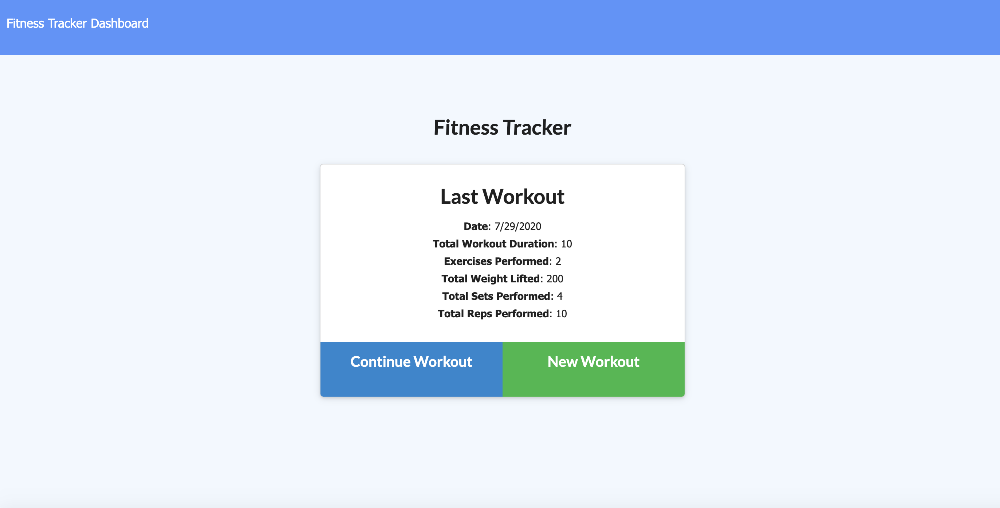
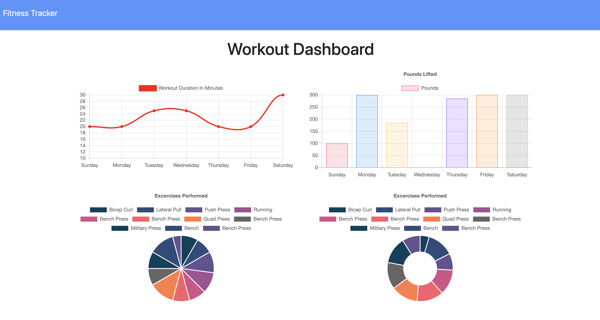

# Fitness Activity Tracker

## Table of Contents
*  [Description](#description)
*  [User Story](#user-story)
*  [Features of the Application](#features-of-the-application)
*  [Preview of the Fitness Activity Tracker](#preview-of-the-fitness-activity-tracker)
*  [Links](#links)
*  [Installation](#installation)
*  [Usage](#usage)
*  [License](#license)
*  [Contributing](#contributing)
*  [Questions](#questions)

## Description

The Fitness Activity Tracker is a dynamic application that tracks resistance and cardio exercises for a given day through user-inputted data. The Fitness Activity Tracker is a useful tool for keeping active, maintaining heart health, and helps the user log their exercises, so that they can see their progress regarding their fitness. The Fitness Activity Tracker will also display weekly summary graphs and charts of all workouts completed.

The application uses MongoDB, a nested Mongoose schema, Express routing, and NodeJS to build its user-inputted database and render the workout information to the application. For the deployed application, the user-inputted database is hosted on MongoDB Atlas.

## User Story
~~~
AS A user  
I WANT to be able to view, create, and track daily workouts  
SO THAT I can keep track of what workouts work best for me and what needs improvement.  
~~~

## Features of the Application
~~~
GIVEN a fitness tracker application that allows the user to log multiple exercises in a workout on a given day  
WHEN I load the page  
THEN I should be given the option to create a new workout or continue with my last workout.  

WHEN I submit data for the provided fields of my exercise  
THEN I will see the name, type, weight, sets, reps, and duration of the exercise displayed on the application.  

WHEN I save a cardio exercise  
THEN I should be able to track and display the distance traveled.  
~~~

## Preview of the Fitness Activity Tracker

The following animation demonstrates the complete application functionality:

## Links

1. [Deployed Application](https://fitness-activity-tracker.herokuapp.com/)

2. [Github Repository](https://github.com/rh9891/FitnessActivityTracker)

## Installation

The application requires the following dependencies and/or package managers:
~~~
$ npm install mongoose
~~~

~~~
$ npm install express
~~~

~~~
$ npm install morgan
~~~

~~~
$ npm install dotenv
~~~

The following dependency - though optional - can also be used as it automatically restarts the node application when file changes in the directory are detected. Saving it as a `devDependency` allows the user to run the application using Nodemon:
~~~
$ npm install nodemon
~~~

## Usage

The application can be initiated by inserting `node server.js` into the command line interface and running the application on `localhost: 3333`.

An example of usage when testing the application using Nodemon as it updates the webpage after every change it detects:
~~~
$ nodemon server.js
~~~

Though, also optional, another example of usage would be to populate the database:
~~~
$ npm run seed
~~~

## License

This application does not currently have any licenses.

The user is not permitted to use, modify, or share any parts of it. Though the code for this application is hosted on Github, where you are allowed to view and fork the code, this does not imply that the user is permitted to use, modify, or share the contents of this application for any purpose.

## Contributing

If you would like to contribute to this repository, please contact me via [Github](https://github.com/rh9891).

## Questions

If you have any questions, comments, or issues regarding this application, please do not hesitate to contact me through [Github](https://github.com/rh9891).